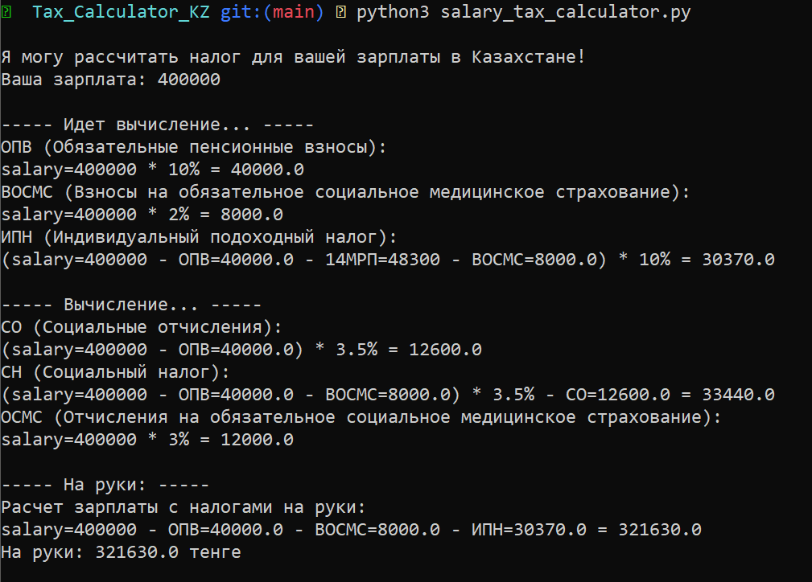

## Калькулятор Налогов на Заработную Плату
> кратко: **_Зарплата - Налоги = Чистая заработная плата._**

Этот Python-скрипт и калькулятор предназначены для расчета различных налогов и определения чистой заработной платы, которую вы получите на руки в Казахстане. 

В калькуляторе использованы принципы функционального программирования, подсказки по типам, а также документированные строки для повышения удобочитаемости и удобства сопровождения.

### Использование:

1. Сделайте клон этого репозитория (или просто скачайте как zip):
```bash
git clone https://github.com/dotpep/kz-tax-calculator.git
```
2. Запустите скрипт:
```bash
python salary_tax_calculator.py
```
3. Введите вашу заработную плату по запросу.
4. Калькулятор отобразит подробную информацию о различных налоговых составляющих, включая пенсионные взносы, подоходный налог и чистую заработную плату.

### Требования:

- Python 3.x

### Демонстрация Результата:


